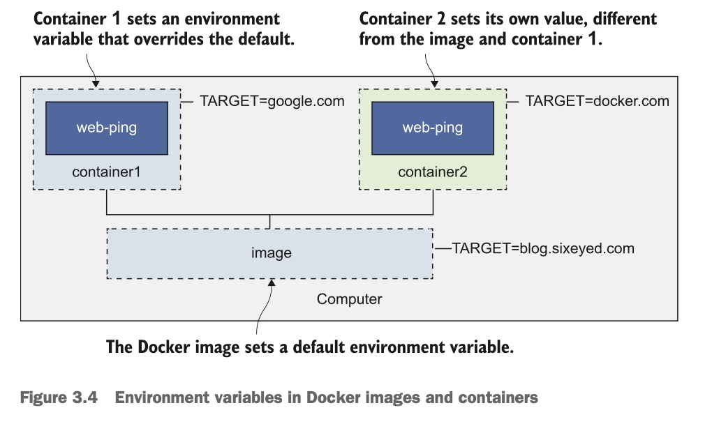
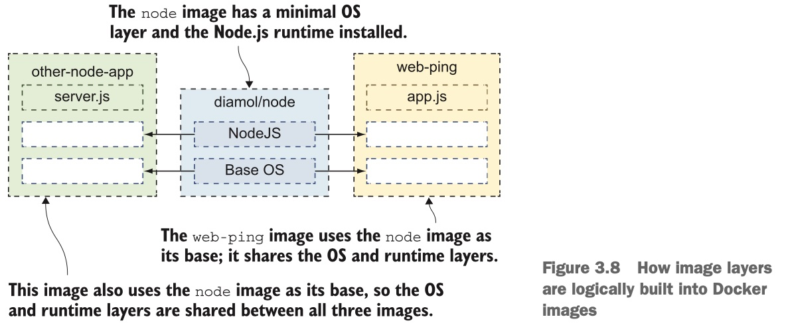

## --env 容器环境变量

每个容器都可以拥有自己的环境变量， **环境变量就是系统提供的 `key/value` **,环境变量给docker image提供了灵活性。

示例：

```shell
# 运行一个容器 这个容器会每隔3s去ping一个默认的网址 blog.sixeyed.com
docker run --name web-ping diamol/ch03-web-ping

# 这个diamol/ch03-web-ping镜像还提供了环境变量的功能
# 可以改变ping的网址
docker rm -f web-ping # 先移除这个容器
# 环境变量key/value对
# --env 可以简写为 -e
docker run --name web-ping --env TARGET=google.com diamol/ch03-web-ping
```



容器中的环境变量，一般定义在 `Dockerfile` 的较上面：

```dockerfile
FROM diamol/node

ENV TARGET="blog.sixeyed.com"
ENV METHOD="HEAD"
ENV INTERVAL="3000"

# ...
```

## Dockerfile

如果想要自定义image，则需要在项目中创建一个 **`Dockerfile`** 文件，比如：

```dockerfile
FROM diamol/node

ENV TARGET="blog.sixeyed.com"
ENV METHOD="HEAD"
ENV INTERVAL="3000"

WORKDIR /web-ping
COPY app.js .

CMD ["node", "/web-ping/app.js"]
```

上面的语法为 **命令 + 参数**：

- **`FROM`**: 表示创建的镜像是基于其它的某个image，这里是将 `diamol/node` 作为镜像的起点，这个镜像安装了nodejs
- **`ENV`**: 设置环境变量，语法是 **`[key]="value"`**,以可以同时设置多个环境变量，比如 **`ENV name="redis" port="6379"`**
- **`WORKDIR`**: 在容器镜像系统中创建一个路径，将其设置为当前工作路径。
- **`COPY`**: 将本地文件系统的文件或者文件夹拷贝到容器镜像中。语法为 **`[source path] [target path]`**, 这里是将本地的 `app.js` 拷贝到上面容器创建的工作路径中
- **`CMD`**: 镜像启动容器后运行的命令，这里是运行nodejs命令


> 打包成image

定义好 **`Dockerfile`** 之后，就可以打包image了，比如：

```shell
# -t 是 --tag 简写 表示image的名字
# . 表示build contet 即Dockerfile所在的本地相对路径，这里表示当前路径
docker build -t web-ping .
```

当出现 `successfully built || successfully tagged`消息后，表明构建image成功，它将存储在本地的image cache中，可以使用 **`docker image ls 'w*'`** 查看 `w` 开头的本地images名

创建成功后，就可以运行容器：

```shell
docker run -e TARGET=baidu.com -e INTERVAL=5000 web-ping
```

## Docker Image Layers

可以使用下面命令查看image的记录：

```shell
docker image history web-ping

# 打印
IMAGE               CREATED             CREATED BY                                      SIZE                COMMENT
ea5e6bdefb88        9 minutes ago       /bin/sh -c #(nop)  CMD ["node" "/web-ping/ap…   0B                  
348cc80c72d3        9 minutes ago       /bin/sh -c #(nop) COPY file:eed098f1f74f146c…   770B                
949161e8db00        9 minutes ago       /bin/sh -c #(nop) WORKDIR /web-ping             0B                  
57a64c9c987b        9 minutes ago       /bin/sh -c #(nop)  ENV INTERVAL=3000            0B                  
2a921300d9cb        9 minutes ago       /bin/sh -c #(nop)  ENV METHOD=HEAD              0B                  
1b72cdaa7a54        9 minutes ago       /bin/sh -c #(nop)  ENV TARGET=blog.sixeyed.c…   0B                  
9dfa73010b19        16 months ago       /bin/sh -c #(nop)  CMD ["node"]                 0B                  
<missing>           16 months ago       /bin/sh -c #(nop)  ENTRYPOINT ["docker-entry…   0B 
...
```

其中 **`CREARED BY`** 命令就是 **`Dockerfile`** 中定义的指令, 每一行都创建一个image layer。**理解镜像layers对高效使用Docker十分重要**

**Docker images 是image layers的逻辑集合，而Layers本质是物理存储在Docker引擎的cache中的文件。另外 image layers能够被不同的images或者containers之间共享**，比如有很多容器运行Nodejs应用，它们将共享包含了nodejs运行时的image layers。如下图所示：

可以使用下面命令查看images的大小：

```shell
docker image ls
# 将所有加起来假设总的大小为 a
# 打印
REPOSITORY             TAG                 IMAGE ID            CREATED             SIZE
web-ping               latest              ea5e6bdefb88        20 minutes ago      75.3MB
redis                  latest              bd571e6529f3        8 days ago          104MB
nginx                  alpine              bd53a8aa5ac9        2 weeks ago         22.3MB
diamol/ch03-web-ping   latest              c748a03c9314        6 weeks ago         75.3MB
python                 alpine              44fceb565b2a        2 months ago        42.7MB
node                   12-alpine           18f4bc975732        2 months ago        89.3MB
diamol/node            latest              9dfa73010b19        16 months ago       75.3MB

# 使用下面命令 查看Docker 中images实际所占用的大小 假设b
docker system ds
# 打印
TYPE                TOTAL               ACTIVE              SIZE                RECLAIMABLE
Images              7                   4                   328.2MB             207.3MB (63%)
Containers          4                   0                   6.674kB             6.674kB (100%)
```

我们会发现实际占用的空间 **`b < a`**, 这说明images之间会贡献共用部分image layers。

**另外，如果image layers被共享，则它们不能被编辑，否则依赖此image layers的其它images会受到影响**


> 使用image layer cache 优化Dockerfiles

上面的 **`web-ping`** 镜像中有个layer是包含应用的JS 文件，如果改变js文件内容，重新构建一个新的image,会得到一个新的image layer。

**Docker 假设在docker image中的layers按照一个预定的顺序，如果改变了sequence中间的layer，Docker则会任务后面的layers将不能复用，因此 `Dockerfile` 中的指令顺序很重要，尽量将不会产生变化的指令放在变化指令的前面，这样就可以充分利用缓存，快速创建image**。

因此最上面定义的web-ping `Dockerfile` 可以优化为：

```dockerfile
FROM diamol/node

# CMD指令 可以放在 FROM指令后的任何地方
# 这里这个指令不会变化
CMD ["node", "/web-ping/app.js"]

# 将3条指令合并成1条指令 减少image layers 层数
ENV TARGET="blog.sixeyed.com" \
		METHOD="HEAD" \
		INTERVAL="3000"

WORKDIR /web-ping
# 将最容易变化的部分 放在后面 上面的image layers 则可以充分利用cache
# 再次构建images时，将提升images构建速度 节省带宽
COPY app.js .
```

再次构建新的image：

```shell
docker build -t web-ping:v2 .
```

会发现，构建步骤从7步减少到了5步（可使用 `docker image history web-ping:v2` 查看）。

改变 `app.js` 内容， 再次构建一个新的image：

```shell
docker build -t web-ping:v3 .

# 打印
Sending build context to Docker daemon  6.656kB
Step 1/5 : FROM diamol/node
 ---> 9dfa73010b19
Step 2/5 : CMD ["node", "/web-ping/app.js"]
 ---> Using cache
 ---> 207fdb992b12
Step 3/5 : ENV TARGET="blog.sixeyed.com"     METHOD="HEAD"     INTERVAL="3000"
 ---> Using cache
 ---> f83bf616e84d
Step 4/5 : WORKDIR /web-ping
 ---> Using cache
 ---> d11bce9780fd
Step 5/5 : COPY app.js .
 ---> 2be09c7444f9
Successfully built 2be09c7444f9
Successfully tagged web-ping:v3
```

可以发现，再次build时会充分利用cache，提升build速度


2020年10月22日21:27:26