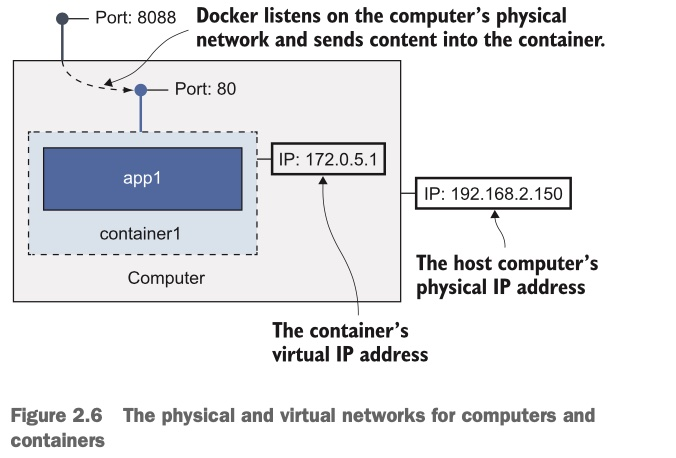

## --publish

简写 **`-p`**, 使用示例：

 ```sh
docker run -d --name mynginx -p 8088:80 nginx
 ```

一开始以为 `-p` 是 `port` 的意思，其实它**表示将容器的端口发布给计算机**的意思。

**当安装工docker时，docker会把自己注册到计算机的网络层，进入你电脑的流量可以被Docker拦截，然后Docker可以将这些流量发送到容器中。**

容器默认情况下是不会暴露在外界的。每个容器都有自己的IP地址，但那是Docker为Docker管理的网络创建的IP地址--容器并没有连接到计算机的物理网络。发布容器端口意味着Docker监听计算机端口上的网络流量，然后将其发送到容器中。在前面的例子中，发送到8088端口的计算机上的流量将被发送到80端口的容器中，如图所示：



这个例子中， 计算机运行docker，它的IP地址是 `192.168.2.150`， 这个IP地址是用于物理网络。Docker运行一个容器，容器的IP地址是 `172.0.5.1`， 这个IP地址是Docker分配的一个被Docker管理的虚拟网络，计算式不能直接连接这个IP地址的，因为这个IP只存在于Docker中。因为我们通过 **`-p 8088:80`** 将Docker内部端口发布出去了。


2020年10月22日19:52:08